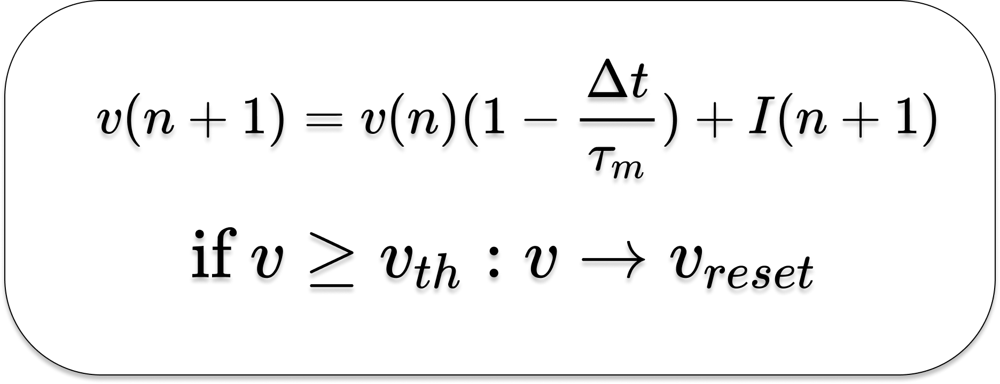

# Comparison_of_Libraries_for_Training_SNN
- [Comparison_of_Libraries_for_Training_SNN](#comparison_of_libraries_for_training_snn)
  - [About](#about)
  - [Target task](#target-task)
  - [Neural network](#neural-network)
  - [Libraries](#libraries)
    - [For TensorFlow version](#for-tensorflow-version)
    - [For norse version (in progress)](#for-norse-version-in-progress)
    - [...](#)
  - [Setup guide](#setup-guide)
## About

This repository provides a comparison of different libraries for the possible application of training tasks for spiking neural networks. In total, three several libraries will be compared: [TensorFlow](https://www.tensorflow.org/), [Norse](https://github.com/norse/norse), ...

## Target task

We will use a simple cognitive task: DM (decision-making task). This task consists of two stages:
1. In the first stage, the network must receive an incentive.
2. In the second stage, the network generates a response.

For simplicity, we use a reduced version of the task, which will consist in the fact that the network must compare the value of the signal with a certain threshold.

## Neural network

We will use the network, which consists of LIF neurons. 


The neuron model (in discretized form) can be described as follows:
<p align="center">

</p>
 

## Libraries
Used ```python 3.10.2``` with follow libraries
### For TensorFlow version
```python
Package                      Version
---------------------------- ---------
absl-py                      1.2.0
astunparse                   1.6.3
cachetools                   5.2.0
certifi                      2022.9.14
charset-normalizer           2.1.1
contourpy                    1.0.5
cycler                       0.11.0
flatbuffers                  2.0.7
fonttools                    4.37.2
gast                         0.4.0
google-auth                  2.11.0
google-auth-oauthlib         0.4.6
google-pasta                 0.2.0
grpcio                       1.49.0
h5py                         3.7.0
idna                         3.4
keras                        2.10.0
Keras-Preprocessing          1.1.2
kiwisolver                   1.4.4
libclang                     14.0.6
Markdown                     3.4.1
MarkupSafe                   2.1.1
matplotlib                   3.6.0
numpy                        1.23.3
oauthlib                     3.2.1
opt-einsum                   3.3.0
packaging                    21.3
Pillow                       9.2.0
pip                          22.2.2
protobuf                     3.19.5
pyasn1                       0.4.8
pyasn1-modules               0.2.8
pyparsing                    3.0.9
python-dateutil              2.8.2
requests                     2.28.1
requests-oauthlib            1.3.1
rsa                          4.9
setuptools                   58.1.0
six                          1.16.0
tensorboard                  2.10.0
tensorboard-data-server      0.6.1
tensorboard-plugin-wit       1.8.1
tensorflow-estimator         2.10.0
tensorflow-gpu               2.10.0
tensorflow-io-gcs-filesystem 0.27.0
termcolor                    2.0.1
typing_extensions            4.3.0
urllib3                      1.26.12
Werkzeug                     2.2.2
wheel                        0.37.1
wrapt                        1.14.1
```
### For norse version (in progress)
### ...
  
## Setup guide
